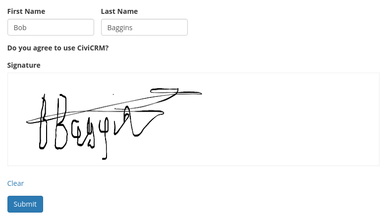

# webform_civicrm_esign

Module to work with the drupal esign module and add the signature as a file to a CiviCRM activity.

## Requirements
Does not work with CiviCRM 4.7.20 (a blank file is generated). Tested with CiviCRM 4.7.29, some earlier versions may work!.

## Setup
Download and install:
- webform_civicrm (https://www.drupal.org/project/webform_civicrm).
- Signature Pad library (https://github.com/szimek/signature_pad) (Release v2.3.0 - v3.0 does not get detected correctly by Drupal). _Reference: Drupal documentation [Installing an external library that is required by a contributed module
](https://www.drupal.org/docs/7/modules/libraries-api/installing-an-external-library-that-is-required-by-a-contributed-module)_
- esign (https://www.drupal.org/project/esign).
  - Requires webform_validation.
  - Enable modules esign and esign_webform.
  Note: If you want to disable the "signer name" and "signer title" fields on the esign field you need to use this patched version of the drupal esign module which adds checkboxes to the "esign" field type: https://github.com/mattwire/drupal_esign
- webform_civicrm_esign (https://github.com/mattwire/webform_civicrm_esign)

## Usage
For each webform that you want to save the signature to an activity you need:

#### In CiviCRM:

* An activity type with a "File" custom field.

#### On each webform:

* A field of type `esign`.
* A field with name: `esign_custom_field`; type: `hidden`; value: A comma-delimited list of custom field names (e.g., `custom_1` or `custom_1,custom_2`). If multiple custom fields are named, they must be listed in the same order as the activities configured on the CiviCRM tab of the webform. See _[Setup Examples](#setup-examples)_ below.
* A field with name: `esign_activity_type_id`; type: `hidden`; value: A comma-delimited list of Activiy Type IDs. If multiple IDs are named, they must be listed in the same order as the activities configured on the CiviCRM tab of the webform. See _[Setup Examples](#setup-examples)_ below.
* Make sure CiviCRM processing is enabled on the webform and that you have added at least one activity of the type(s) you specified in `esign_activity_type_id` field.

Optionally, file the activity on a case by enabling a Case within the CiviCRM processing and setting the Activity to "File on Case".

* Filenames will be created in the format "sig_20191119000000_firstnamelastname.png" if civicrm firstname/lastname fields are found.  If not name will be omitted.
* esign_custom_field and esign_activity_type_id will not be shown in emails / submission views.

##### Setup Examples

|Use case|`esign_custom_field` example|`esign_activity_type_id` example|notes|
|---|---|---|---|
|A single custom field on a single activity|custom_9|70||
|A single custom field on multiple activities (must be different types)|custom_9,custom_9|70,71||
|Two custom fields on a single activity|custom_9,custom_10|70,70|Note that the same activity_type_id is given twice|
|Different custom fields on different activities (different types)|custom_9,custom_10|70,71||

## Known issues

* Due to a technical quirk, this module does not support attaching signatures to multiple activities of the same activity type in one form. Please submit an issue if you're interested in addressing this limitation.
